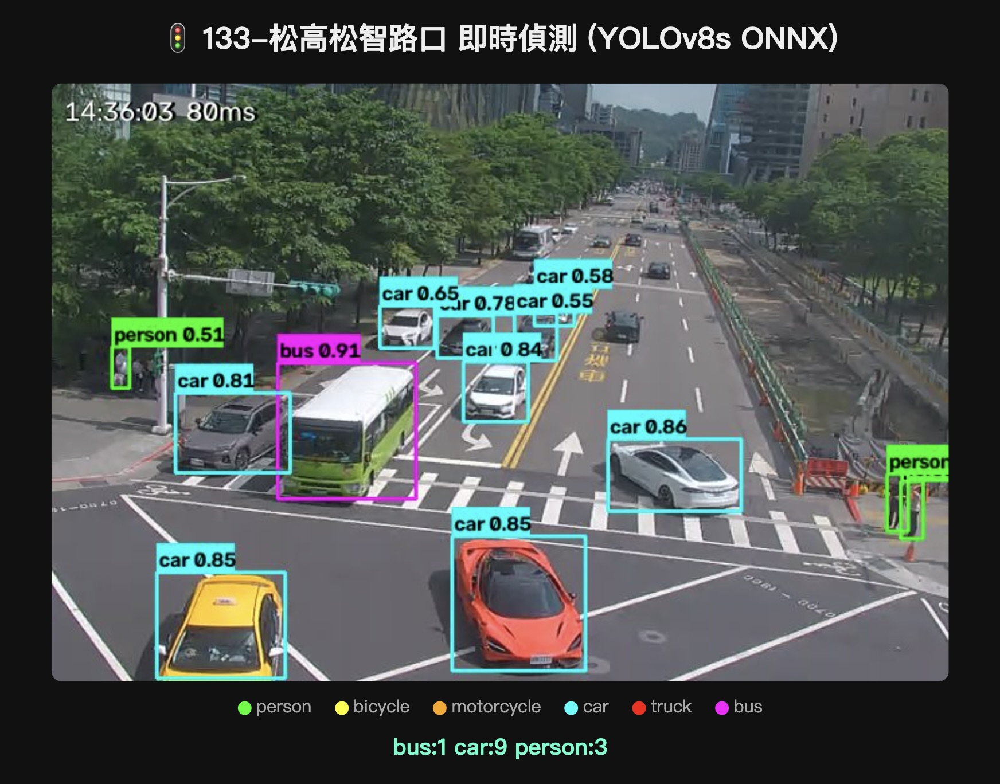
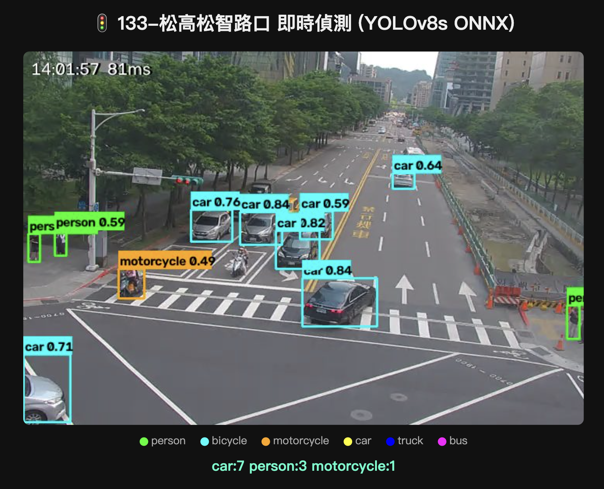
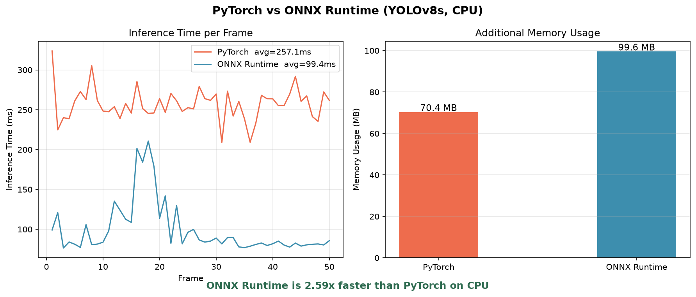

# Traffic-Detection

Real-time object detection on live Taipei city traffic camera streams using YOLOv8s ONNX Runtime, served via FastAPI and containerized with Docker.



## Highlights

- Exports YOLOv8s from PyTorch `.pt` to ONNX format via `yolo export`, runs inference with ONNX Runtime
- Connects to Taipei City Government HLS live streams (`.m3u8`) via OpenCV, runs inference every 3 frames
- FastAPI serves a live annotated JPEG feed (`/feed`) and a JSON detection API (`/detect`)
- Fully containerized with Docker, stream URL injected via environment variable

## More Detections



## Benchmark: ONNX Runtime vs PyTorch (CPU)



ONNX Runtime runs **2.59x faster** than PyTorch on CPU (avg 99ms vs 257ms per frame), with no loss in detection accuracy. This gap is expected to widen further on edge hardware with TensorRT.

## Pipeline

```
HLS Stream → OpenCV → Preprocess (640×640) → ONNX Runtime → Postprocess + NMS → FastAPI → Browser
```

## Motivation

Simulates the engineering workflow of deploying a CV model to an edge device (e.g. Nvidia Jetson):

```
PyTorch training → ONNX export → ONNX Runtime inference → API service → Docker
```

The same ONNX model can switch execution providers (CPU, CUDA, TensorRT) with a single line change, no model modification needed.

## Usage (Development)

```bash
cp .env.example .env
docker compose -f docker-compose.dev.yml run -p 8001:8000 dev
export HLS_URL=$(grep HLS_URL .env | cut -d= -f2)
python -m src.stream
```

Open `http://localhost:8001` to view the live detection feed.

Run the benchmark:

```bash
python -m src.benchmark --frames 50
```

## Usage (Production)

Requires `models/yolov8s.onnx` to exist locally first (run `yolo export model=yolov8s.pt format=onnx opset=17` and move the output into `models/`).

```bash
docker build -t traffic-detection .
docker run -p 8002:8000 --env HLS_URL="your_stream_url" traffic-detection
```

Open `http://localhost:8002` to view the live detection feed. This image is fully self contained; the model and code are baked in, only the stream URL is passed at runtime.

## Known Limitations

- Motorcycle and bicycle detection is unreliable at overhead angles due to domain shift from COCO training data. Riders are often classified as person when viewed from above. Fine tuning on local traffic footage would improve this.
- Inference runs on CPU only. Switching to `TensorrtExecutionProvider` on Jetson would reduce latency from about 90ms to under 10ms.
- Stream URL may expire and require re extraction from browser DevTools.